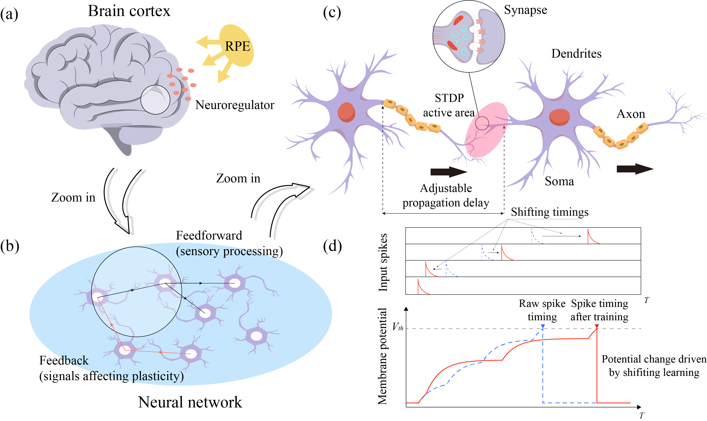
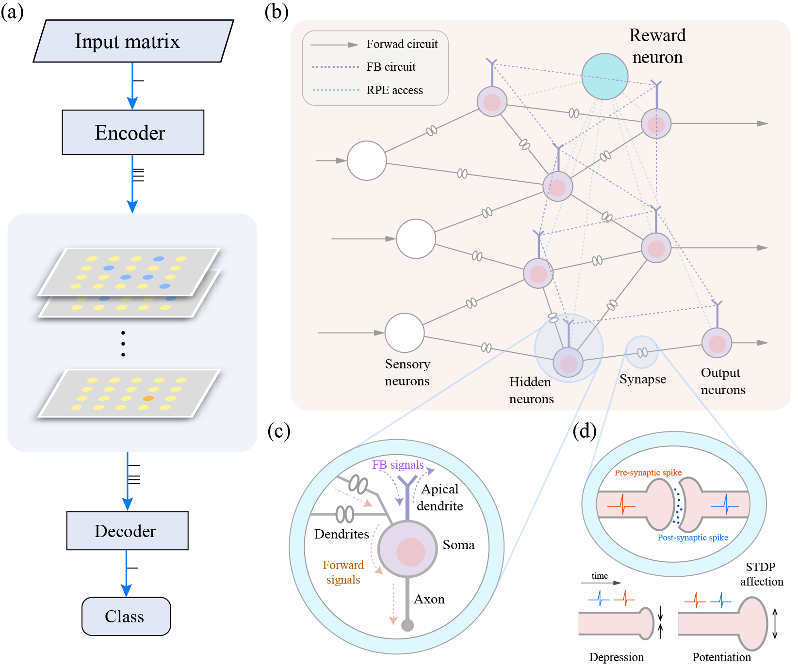

# Shifting Learning: A Biologically Plausible Learning Paradigm for Spiking Neural Networks

This is the official code repository for the paper: Shifting Learning: A Biologically Plausible Learning Paradigm for Spiking Neural Networks

In our paper, we introduce:

- **A brain-inspired spiking learning system:** In this system, the information is transmitted in the form of spikes, and synaptic connection strengths are treated as realistic, timing-dependent variables called shifting timings.

- **Shifting learning algorithm:** The mechanism is based on three factors: the local affection from the STDP mechanism, the feedback signal transmitted through the feedback connection, and the global reward-punishment signal produced by the release of neuromodulators. It leverages a combination of biological signals to achieve performance comparable to same-scale spiking neural networks trained with gradient methods.

Dataset.py --> Preprocess the datasets used to train and test our model, including Iris, Spike, MNIST, and Fashion-MNIST. The raw datasets are provided here; please refer to the datasets folder. The Spike dataset, which includes the files "gamma_5-inhomogbgnoise-trials-250-syn-500-feat-9-train" and "gamma_5-inhomogbgnoise-trials-250-syn-500-feat-9-validation", is used for validating the temporal credit assignment (TCA) problem.

SL_Layer.py & SL_MultiInputLy.py --> Our model, spiking neural network (SNN) equipped with shifting learning. There are two variants: (1) SL_Layer.py for input neurons receive a single spike from each synapse in a trial, and (2) SL_MultiInputLy.py for input neurons can receive multiple spikes from each synapse used in the TCA task.

SL_xor.py --> Our model used to solve the XOR problem. It can be run once directly or executed multiple times to report the accuracy. The number of repetitions can be set manually.

SL_small.py --> Our model used to solve the Iris classification task. It is designed as a platform that can be easily generalized to handle other small-scale benchmarks.

SL_mnist.py --> Our model applied to the MNIST and Fashion-MNIST datasets, and it can be accelerated using GPUs.

